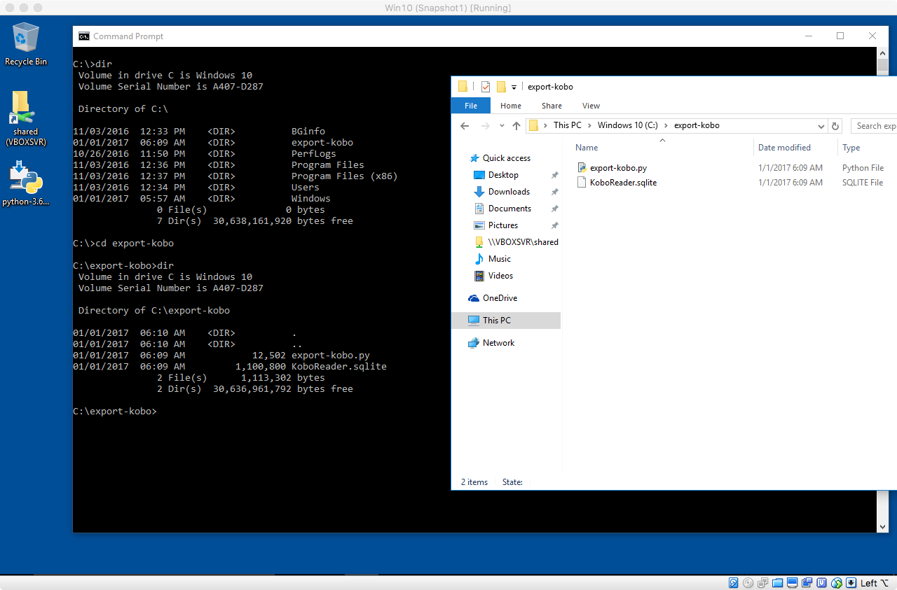
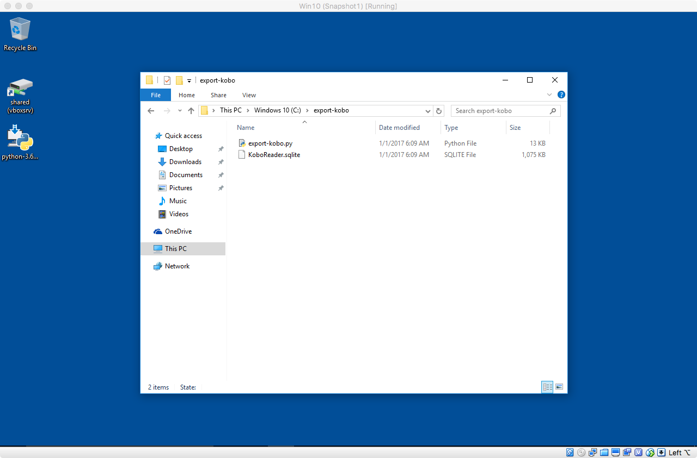
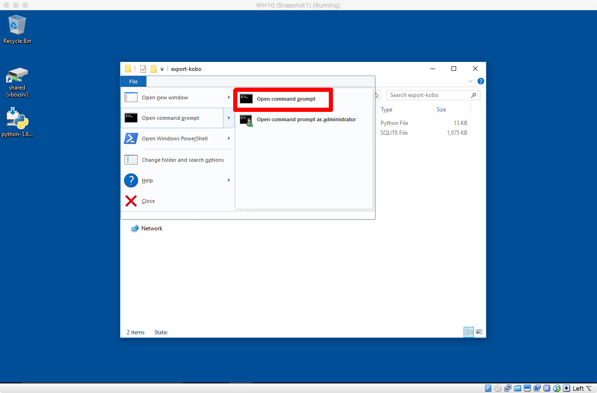
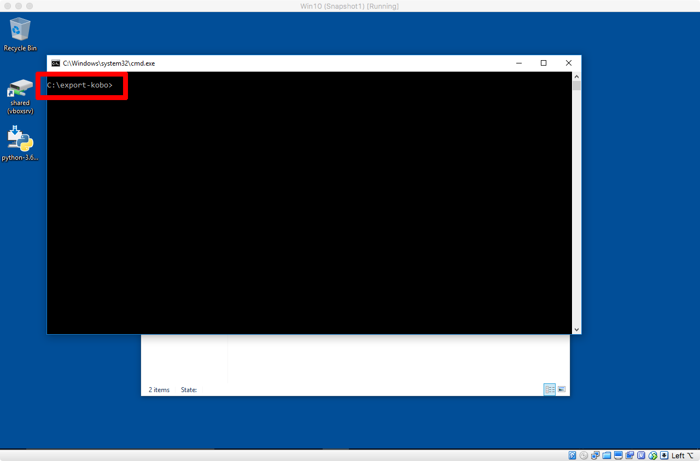
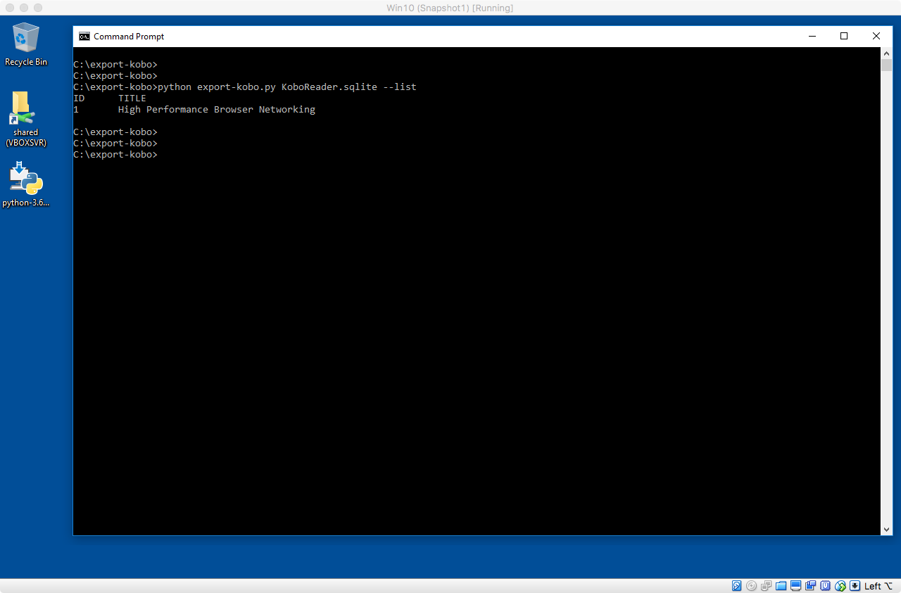
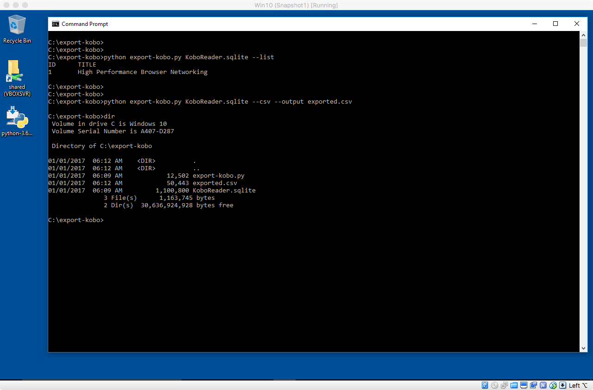
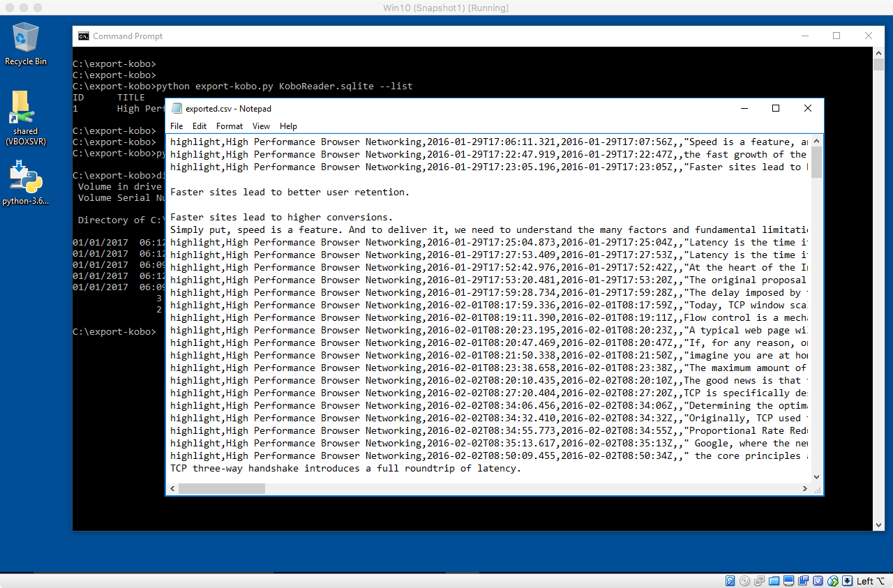
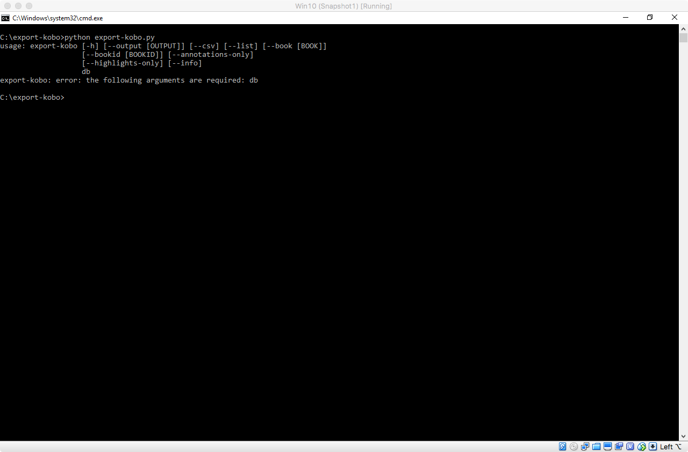
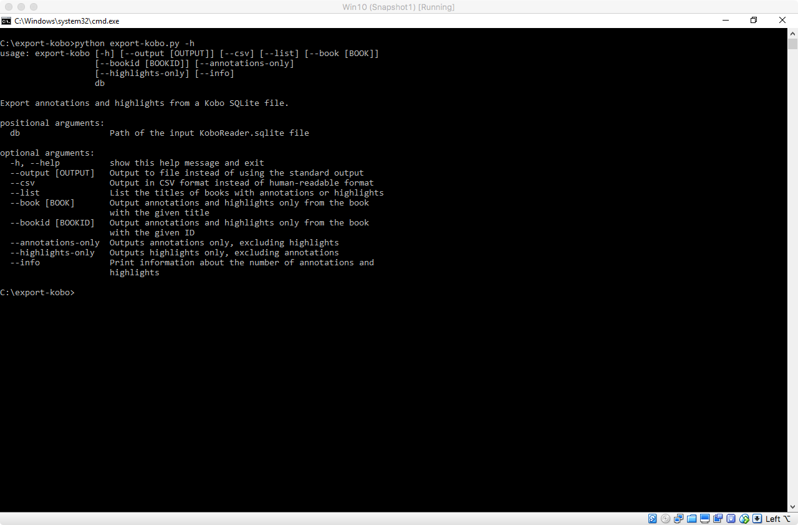

# Python-Practicals

## Lab Practice - Implementation of Python Programs

### We love Programming. Our aim with this course is to create a love for Programming.

  
:zap: Running A Python Program

   

Excellent, now you have all the tools required
to run a Python program on the command line.

As an illustration,
I will use my simple Python script
[``export-kobo``](https://github.com/pettarin/export-kobo/),
which reads annotations and highlights
from the database file of a Kobo eReader device (``KoboReader.sqlite``),
and prints them on the prompt or exports them to an output file.

### Step 1: Download The Source Code

First, download the source code of the Python program you want to run.

This usually implies **downloading** either **a single Python source code** file
(with extension ``.py``), or **a ZIP file containing several Python source code files**
and other resource files that you need to uncompress somewhere on your disk.

The exact details depend on your Python program,
hence be sure to **carefully read its install documentation**.
You can download the prescribed files with your browser,
and then copy/uncompress them using the Windows graphical file manager.

In our example, we download the raw file
[``export-kobo.py``](https://raw.githubusercontent.com/pettarin/export-kobo/master/export-kobo.py)
from the GitHub repository.

Remember **Safety Rule 3**
("copy your Python files into a separate folder")?

We put the downloaded ``export-kobo.py`` file
in a new folder ``C:\export-kobo``:

Note that we also copied
the ``KoboReader.sqlite`` file
(the input of our Python program)
from our Kobo eReader
to the same folder.

### Step 2: Open A Command Prompt And ``cd`` There

Then, open a Command Prompt as explained above,
and change the current working directory to the folder
where you put your Python program source files.

In our example, ``cd C:\export-kobo``:

A simpler alternative to using the ``cd`` command
takes advantages of the Windows file explorer.
Just navigate the file explorer to the folder
where your Python code is:

and select the
``File > Open command prompt > Open command prompt``
menu:

you will get a new Command Prompt window,
already located at the correct directory:

### Step 3: Run The Python Program

At this point, we are ready to run our program.

Type ``python export-kobo.py KoboReader.sqlite --list`` and hit Enter/Return:

The Python interpreter will load our ``export-kobo.py`` program,
and run it with arguments ``KoboReader.sqlite`` and ``--list``.

Clearly, **the semantics of the arguments vary from program to program**,
depending on what each program is supposed to do.

In our case, ``export-kobo.py`` will read the file
whose name is passed as the first parameter (``KoboReader.sqlite``)
and it will list (``--list`` option) the titles of all the eBooks
with annotations or highlights in the database.

If we specify different command arguments, for example
``python export-kobo.py KoboReader.sqlite --csv --output exported.csv``,
we will get a different behavior:

In particular, this second command exported all the information
contained in the ``KoboReader.sqlite`` file into
the newly created file named ``exported.csv`` in CSV format:

You must **check the documentation** of your Python program
to know the semantics of its arguments.

Usually, if you run a Python program without arguments
you will get a synopsis of the accepted arguments:

If a ``-h`` or ``--help`` argument is given,
then a more verbose help message will be printed:

**Congratulations, now you should be able
to download and run a Python program on your own!**

  
:zap: Lab Contents

   

- 1. [Python program to swap two variables using third variable.](https://github.com/Realocity/Python-Practicals/blob/main/Practical%201/Q1.py)

- 2. [Write a python program to swap two numbers without using third variable.](https://github.com/Realocity/Python-Practicals/blob/main/Practical%201/Q2.py)

- 3. [Write a python program to read two numbers and find the sum of their cubes.](https://github.com/Realocity/Python-Practicals/blob/main/Practical%201/Q3.py)

- 4. [Write a python program to read three numbers and if any two variables are equal, print that number.](https://github.com/Realocity/Python-Practicals/blob/main/Practical%201/Q4.py)

- 5. [Write a python program to read three numbers and find the smallest among them.
](https://github.com/Realocity/Python-Practicals/blob/main/Practical%201/Q5.py)

- 6. [Write a python program to read three numbers and print them in ascending order (without using sort function)](https://github.com/Realocity/Python-Practicals/blob/main/Practical%202/Q6.py)

- 7. [Write a python program to read radius of a circle and print the area.](https://github.com/Realocity/Python-Practicals/blob/main/Practical%202/Q7.py)

- 8. [Write a python program to read a number, 
 if it is an even number, 
 print the square of that number and if it is odd number print cube of that number.](https://github.com/Realocity/Python-Practicals/blob/main/Practical%202/Q8.py)

- 9. [Write a Python program to calculate the length of a string.](https://github.com/Realocity/Python-Practicals/blob/main/Practical%202/Q9.py)

- 10. [Write a Python program to count the number of characters (character frequency) in a string.](https://github.com/Realocity/Python-Practicals/blob/main/Practical%202/Q10.py)

- 11. [Write a Python script to add a key to a dictionary.
Sample Dictionary : {0: 10, 1: 20}
Expected Result : {0: 10, 1: 20, 2: 30}](https://github.com/Realocity/Python-Practicals/blob/main/Practical%203/Q11.py)

- 12. [Write a Python script to concatenate following dictionaries to create a new one.
dic1={1:10, 2:20}
dic2={3:30, 4:40}
dic3={5:50,6:60}
Expected Result : {1: 10, 2: 20, 3: 30, 4: 40, 5: 50, 6: 60}](https://github.com/Realocity/Python-Practicals/blob/main/Practical%203/Q12.py)

- 13. [Write a Python script to check if a given key already exists in a dictionary.](https://github.com/Realocity/Python-Practicals/blob/main/Practical%203/Q13.py)
  
- 14. [Write a Python script to generate and print a dictionary that contains a number (between 1 and n) 
in the form (x, x*x).
Sample Dictionary ( n = 5) :
Expected Output : {1: 1, 2: 4, 3: 9, 4: 16, 5: 25}.](https://github.com/Realocity/Python-Practicals/blob/main/Practical%203/Q14.py)
  
- 15. [Write a Python script to merge two Python dictionaries.](https://github.com/Realocity/Python-Practicals/blob/main/Practical%203/Q15.py)
  
- 16. [Write a recursive function to calculate the sum of numbers from 0 to 10.](https://github.com/Realocity/Python-Practicals/blob/main/Practical%204/Q16.py)
  
- 17. [Given a list slice it into 3 equal chunks and reverse each chunk .
'''
Original list [11, 45, 8, 23, 14, 12, 78, 45, 89]
Chunk 1 [11, 45, 8]
After reversing it [8, 45, 11]
Chunk 2 [23, 14, 12]
After reversing it [12, 14, 23]
Chunk 3 [78, 45, 89]
After reversing it [89, 45, 78].](https://github.com/Realocity/Python-Practicals/blob/main/Practical%204/Q17.py)
  
- 18. [Write a Python script to display the various Date Time formats.
'''
a) Current date and time 
b) Current year 
c) Month of year 
d) Week number of the year 
e) Weekday of the week 
f) Day of year 
g) Day of the month 
h) Day of week
'''.](https://github.com/Realocity/Python-Practicals/blob/main/Practical%204/Q18.py)
  
- 19. [Write a Python program to read first n lines of a file.](https://github.com/Realocity/Python-Practicals/blob/main/Practical%205/Q19.py)
  
- 20. [Write a Python program to copy the contents of a file to another file.](https://github.com/Realocity/Python-Practicals/blob/main/Practical%205/Q20.py)
  
- 21. [Write a Python program to count the number of lines in a text file.](https://github.com/Realocity/Python-Practicals/blob/main/Practical%205/Q21.py)

## Usage
  
How do I run a Python script that I downloaded from GitHub?
Download python installer from their official website [here](https://www.python.org/downloads/). After installing, open the folder where you have downloaded the script, press and hold shift and right click anywhere in the folder, in the popup there will be a option to open command prompt here (if you are using windows 8.1 or lower) or open powershell here (if you are using windows 10) click on it, a black window will appear, paste the below command in that where filename.py is name of the python file you have downloaded.

python filename.py 
  
And now press enter. Voila your python script will now run.

## [A step-by-step guide on installing Python and using the Command Prompt for Windows](https://github.com/pettarin/python-on-windows/blob/master/README.md)

### Interesting things to try

Make some changes in the code and observe the output.

## Built by (A-Z)

- [Shubham Sapkal](https://github.com/Realocity)

## License

MIT © Realocity
